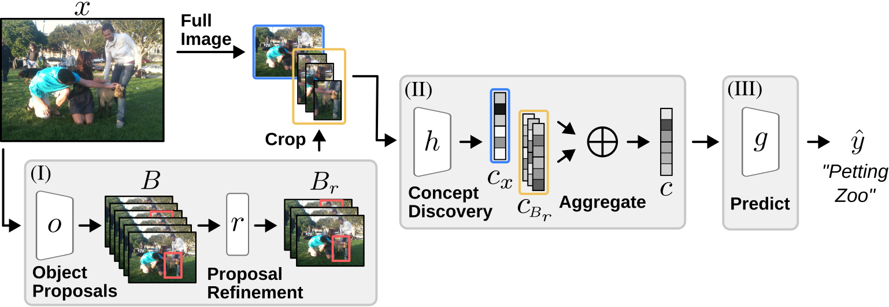
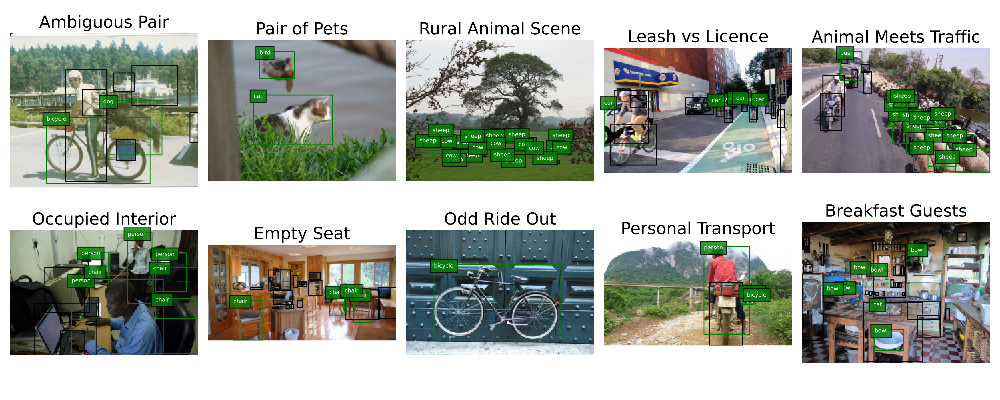

# Object-Centric-Concept-Bottlenecks

This repository contains code for computing concept embeddings and training predictor models using object-centric bottlenecks (https://arxiv.org/abs/2505.24492). The approach extends traditional concept-based models by incorporating object-level semantics for improved interpretability and performance.



---

## Installation

You can set up the environment in one of two ways:

### Option 1: Docker (Recommended)

Use the provided Docker environment to ensure full compatibility.  
Instructions for building and running the container can be found in the [`.docker/`](.docker/) directory.

### Option 2: Manual Environment

If you prefer setting up manually, create a Python environment (Python 3.8+ recommended), and install required packages. In addition to the usual dependencies, **you must install the following manually**:

- SpLiCE: https://github.com/AI4LIFE-GROUP/SpLiCE
- SAM (Segment Anything Model): ``pip install git+https://github.com/facebookresearch/segment-anything.git``

---

## Embedding Computation

To compute the concept embeddings, run:

```bash
python generate_concepts.py
--dataset                Dataset to use ['coco', 'sun', 'voc', 'cocologic']
--data_dir               Path to the image dataset
--encoding_dir           Where to store image-level embeddings (default: encodings)
```

To enable object-based encodings, use the flag ``--use_object_concepts``. Additional relevant options include:

```
--num_objects              Number of objects per image (default: 10)
--min_object_size          Minimum object size (relative, default: 0.02)
--max_object_size          Maximum object size (relative, default: 0.85)
--min_score                Minimum object proposal score (default: 0.2)
--max_iou_threshold        Max IoU threshold for filtering proposals (default: 0.5)
--object_encoding_dir      Output directory for object encodings (default: obj_encodings)
--object_detection_model   Detection model to use ['mask-rcnn', 'sam']
```

## Model Training
Once embeddings are generated, you can train a predictor model via `` python train.py ``
### Basic Training Settings:
```
--num_epochs              Number of training epochs (default: 40)
--learning_rate           Learning rate (default: 0.001)
--prediction_level        Class granularity ['super', 'normal']
--task_type               Task type ['multilabel', 'multiclass']
--dataset                 Dataset name ['coco', 'sun', 'voc', 'cocologic']
--encoding_dir            Path to image-level embeddings
```

For baseline/ablation experiments:

```
--only_objects            If set, aggregate only object encodings instead of combining with image encodings
--no_concepts             If set, disables the use of concepts in the model
```


### Additional Parameters for OCB Training:

```
--aggregation             Object encoding aggregation ['sum', 'max', 'concat', sum_count', 'count']
--num_objects              Same as during embedding generation
--num_objects_training     Number of objects used during training (up to a maximum of num_objects)
--object_encoding_dir      "
--min_object_size          "
--max_object_size          "
--min_score                "
--max_iou_threshold        "
--object_detection_model   "
--only_objects             " 
--no_concepts              "
```

### WandB Logging

The codebase supports experiment tracking with Weights & Biases (WandB).
To enable logging, configure the following arguments:

```
--wandb_project           WandB project name
--wandb_run_name          Run name for experiment tracking
```

When enabled, all metrics, losses, and configuration parameters will be logged automatically to your WandB dashboard.

### Scripts

Helper scripts for precomputing embeddings and launching training can be found in the ``scripts/`` directory.


## COCOLogic Dataset

We introduce **COCOLogic**, a benchmark derived from the MSCOCO dataset that evaluates a model’s ability to perform structured visual reasoning in a single-label classification setting. Unlike standard object recognition tasks, COCOLogic requires classification based on logical combinations of object categories, including conjunctions, disjunctions, negations, and counting constraints.

Each image is assigned to exactly one of ten mutually exclusive classes, ensuring unambiguous labeling. These classes are defined by semantically meaningful logical rules (e.g., “occupied interior” requires a chair or couch *and* at least one person, while “empty seat” requires the same furniture but *no* person). Images that do not satisfy exactly one rule are excluded.



This design makes COCOLogic a challenging benchmark for both symbolic and neuro-symbolic models. COCOLogic covers scenes across ten categories with varying numbers of samples and serves as a bridge between logical reasoning and visual understanding in realistic natural images.

### Class Definitions

| **Class Name**       | **Class Rule**                                                                    | **Samples** |
| -------------------- | --------------------------------------------------------------------------------- | ----------- |
| Ambiguous Pairs      | (cat XOR dog) AND (bicycle XOR motorcycle)                                        | 36          |
| Pair of Pets         | Exactly two categories of {cat, dog, bird} are present                            | 56          |
| Rural Animal Scene   | At least one of {cow, horse, sheep} AND no person                                 | 2965        |
| Leash vs Licence     | dog XOR car                                                                       | 4188        |
| Animal Meets Traffic | At least one of {horse, cow, sheep} AND at least one of {car, bus, traffic light} | 24          |
| Occupied Interior    | (couch OR chair) AND at least one person                                          | 8252        |
| Empty Seat           | (couch OR chair) AND no person                                                    | 4954        |
| Odd Ride Out         | Exactly one category of {bicycle, motorcycle, car, bus}                           | 3570        |
| Personal Transport   | person AND (bicycle XOR car)                                                      | 279         |
| Breakfast Guests     | bowl AND at least one of {dog, cat, horse, cow, sheep}                            | 169         |


### Usage

The cocologic dataset is parsed from the MS-COCO dataset. With the COCO dataset available, the COCOLogic class in `data.py` parses and filters the original dataset and provides COCOLogic.


If you use the dataset, please cite the paper, for example with the following bibtex:

```
@article{steinmann2025object,
  title={Object Centric Concept Bottlenecks},
  author={Steinmann, David and Stammer, Wolfgang and W{\"u}st, Antonia and Kersting, Kristian},
  journal={arXiv preprint arXiv:2505.24492},
  year={2025}
}
```